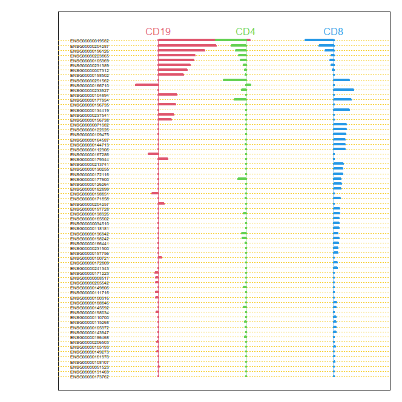
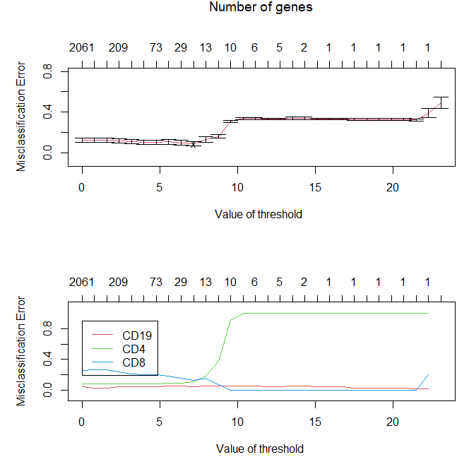

```{r setup, include=FALSE}
knitr::opts_chunk$set(echo = TRUE)
library(randomForest)
```

Statement of contribution: Assignment 1 was contributed mostly by Otto, 

# 1. Assignment 1 - Ensemble methods

This assignment concerns training and analyzing random forests. 

### 1.1 - Random forest for y = x1<x2

In this section we create 1000 training datasets, each containing 100 observations with three variables. X1 and X2 are generated as random numbers from the uniform distribution with boundaries 0 and 1. Y is then created as a categorical variable based on X1 and X2 with two values; one when X1<X2 and one when X1=>X2. In total three random forests are learned on each training set, one with 1 tree, one with 10 trees and one with 100 trees. The training datasets are created with the following code:
```{r}
datasets <- list(list(x=0,
                      y=0))
set.seed(12345)
for (set in 1:1000) {
  x1<-runif(100)
  x2<-runif(100)
  trdata<-cbind(x1,x2)
  y<-as.numeric(x1<x2)
  trlabels<-as.factor(y)
  datasets[[set]] <- list(x=trdata,
                      y=trlabels)
}
```

To analyze how these random forests perform a test dataset with 1000 observations is created with the following code:
```{r}
set.seed(1234)
x1<-runif(1000)
x2<-runif(1000)
tedata<-cbind(x1,x2)
y<-as.numeric(x1<x2)
telabels<-as.factor(y)
plot(x1,x2,col=(y+1))
```

With the datasets created the random forests can now be learned with the following code:
```{r}
trees <- c(1,10,100)
forests <- list(list(list()))
set.seed(12345)
for (set in 1:1000) {
  forests[[set]] <- list()
  for (ntrees in 1:3) {
    forests[[set]][[ntrees]] <- randomForest(x = datasets[[set]]$x, 
                                             y = datasets[[set]]$y,
                                             xtest = tedata,
                                             ytest = telabels, 
                                             ntree = trees[ntrees],
                                             nodesize = 25,
                                             keep.forest = TRUE)
  }
}
```

For these forests the misclassification errors are all calculated. We then compute the mean and variance of this error for all of the random forests with the same amount of trees:
```{r}
# Misclassification  with 1 tree
errors_onetree <- 0
for (set in 1:1000) {
  errors_onetree[set] <- forests[[set]][[1]][["test"]][["err.rate"]][[1]] 
}

# Misclassification with 10 trees
errors_tentrees <- 0
for (set in 1:1000) {
  errors_tentrees[set] <- forests[[set]][[2]][["test"]][["err.rate"]][[10]] 
}

# Misclassification with 100 trees
errors_hundredtrees <- 0
for (set in 1:1000) {
  errors_hundredtrees[set] <- forests[[set]][[3]][["test"]][["err.rate"]][[100]] 
}

c(mean(errors_onetree), mean(errors_tentrees), mean(errors_hundredtrees))
c(var(errors_onetree), var(errors_tentrees), var(errors_hundredtrees))
```
As can be observed the mean misclassification error goes down as the number of trees goes up, from 0.2 at one tree down to 0.11 at one hundred trees. Similarly the variance of the error also goes down as the number of trees goes up.

### 1.2 - Random forest for y = x1<0.5

In this section we repeat the steps taken in 1.1, but instead compute Y based on X1<0.5 instead. The new data is set up with the following code:
```{r}
# Generate 1000 data sets
datasets <- list(list(x=0,
                      y=0))
set.seed(12345)
for (set in 1:1000) {
  x1<-runif(100)
  x2<-runif(100)
  trdata<-cbind(x1,x2)
  y<-as.numeric(x1<0.5)
  trlabels<-as.factor(y)
  
  datasets[[set]] <- list(x=trdata,
                      y=trlabels)
}

# Test data
set.seed(1234)
x1<-runif(1000)
x2<-runif(1000)
tedata<-cbind(x1,x2)
y<-as.numeric(x1<0.5)
telabels<-as.factor(y)
plot(x1,x2,col=(y+1))
```
The random forests are then learned with the following code:
```{r}
trees <- c(1,10,100)
forests_two <- list(list(list()))
set.seed(12345)
for (set in 1:1000) {
  forests_two[[set]] <- list()
  for (ntrees in 1:3) {
    forests_two[[set]][[ntrees]] <- randomForest(x = datasets[[set]]$x, 
                                             y = datasets[[set]]$y,
                                             xtest = tedata,
                                             ytest = telabels, 
                                             ntree = trees[ntrees],
                                             nodesize = 25,
                                             keep.forest = TRUE)
  }
}
```

Finally the misclassification rates are computed with the following code:
```{r}
# Misclassification  with 1 tree
errors_onetree_two <- 0
for (set in 1:1000) {
  errors_onetree_two[set] <- forests_two[[set]][[1]][["test"]][["err.rate"]][[1]] 
}

# Misclassification with 10 trees
errors_tentrees_two <- 0
for (set in 1:1000) {
  errors_tentrees_two[set] <- forests_two[[set]][[2]][["test"]][["err.rate"]][[10]] 
}

# Misclassification with 100 trees
errors_hundredtrees_two <- 0
for (set in 1:1000) {
  errors_hundredtrees_two[set] <- forests_two[[set]][[3]][["test"]][["err.rate"]][[100]] 
}

c(mean(errors_onetree_two), mean(errors_tentrees_two), mean(errors_hundredtrees_two))
c(var(errors_onetree_two), var(errors_tentrees_two), var(errors_hundredtrees_two))
```
As in the previous section both the mean and variance of the error rate goes down as the number of trees goes up.

### 1.3 - Random forest for y = x1<05 & x2<0.5 | x1>0.5 & x2>0.5

Once again we repeat the exercise, this time with Y computed based on x1<05 & x2<0.5 or x1>0.5 & x2>0.5. The data is set up with the following code:
```{r}
# Generate 1000 data sets
datasets <- list(list(x=0,
                      y=0))
set.seed(12345)
for (set in 1:1000) {
  x1<-runif(100)
  x2<-runif(100)
  trdata<-cbind(x1,x2)
  y<-as.numeric((x1<0.5 & x2<0.5)|(x1>0.5 & x2>0.5))
  trlabels<-as.factor(y)
  
  datasets[[set]] <- list(x=trdata,
                      y=trlabels)
}

set.seed(1234)
x1<-runif(1000)
x2<-runif(1000)
tedata<-cbind(x1,x2)
y<-as.numeric((x1<0.5 & x2<0.5)|(x1>0.5 & x2>0.5))
telabels<-as.factor(y)
plot(x1,x2,col=(y+1))
```
The random forests are then learned with the following code:
```{r}
trees <- c(1,10,100)
forests_three <- list(list(list()))
set.seed(12345)
for (set in 1:1000) {
  forests_three[[set]] <- list()
  for (ntrees in 1:3) {
    forests_three[[set]][[ntrees]] <- randomForest(x = datasets[[set]]$x, 
                                                 y = datasets[[set]]$y,
                                                 xtest = tedata,
                                                 ytest = telabels, 
                                                 ntree = trees[ntrees],
                                                 nodesize = 12,
                                                 keep.forest = TRUE)
  }
}
```

Finally the misclassification rates are computed with the following code:
```{r}
# Misclassification  with 1 tree
errors_onetree_three <- 0
for (set in 1:1000) {
  errors_onetree_three[set] <- forests_three[[set]][[1]][["test"]][["err.rate"]][[1]] 
}

# Misclassification with 10 trees
errors_tentrees_three <- 0
for (set in 1:1000) {
  errors_tentrees_three[set] <- forests_three[[set]][[2]][["test"]][["err.rate"]][[10]] 
}

# Misclassification with 100 trees
errors_hundredtrees_three <- 0
for (set in 1:1000) {
  errors_hundredtrees_three[set] <- forests_three[[set]][[3]][["test"]][["err.rate"]][[100]] 
}

c(mean(errors_onetree_three), mean(errors_tentrees_three), mean(errors_hundredtrees_three))
c(var(errors_onetree_three), var(errors_tentrees_three), var(errors_hundredtrees_three))
```
Just as with the previous two datasets the mean and the variance of the error of the misclassification error goes down as the number of trees goes up.

### 1.4 - Questions

In this section we answer some questions on the topic of random forests.

**a) What happens with the mean and variance of the error rate when the number of trees in the random forest grows?**

Overall as the number of trees grows the mean and variance of the error rate goes down. 
  
  
**b) The third dataset represents a slightly more complicated classification problem than the first one. Still, you should get better performance for it when using sufficient trees in the random forest. Explain why you get better performance.**  

The reason why the performance improves when using more trees is because, even though the problem is a more complicated one, if the trees in general predict better than randomly guessing (error rate of 0.5) then as the number of trees increases they will on average achieve a better result. This is because the final decision for an observation is done by majority voting among the trees in the forest and so if the trees on average do better than random then a larger amount of trees will increase the chance that the majority of them voted for the right class. 
  
  
**c) Why is it desirable to have low error variance?**  

Low error variance means that a larger amount of the trees in the forest predict correct and incorrect values for the test set at a similar rate. This is desirable as it suggests that the individual trees are not overfitted on their respective training set, which if it were the case would lead to a larger variance as each tree is more dependent on the data it used for training and as such more often return different predictions for the same observation in the test set.

# 2. Assignment 2 - Mixture models

### Problem Description :
The problem was to implement expectation minimization algorithm for Bernouli 
multivariate mixture model and analyze the estimated parameters and the 
likelihood for K = 2,3,4.

```{r echo = FALSE}
set.seed(1234567890)

max_it <- 100 # max number of EM iterations
min_change <- 0.1 # min change in log likelihood between two consecutive EM iterations
N=1000 # number of training points
D=10 # number of dimensions
x <- matrix(nrow=N, ncol=D) # training data

true_pi <- vector(length = 3) # true mixing coefficients
true_mu <- matrix(nrow=3, ncol=D) # true conditional distributions
true_pi=c(1/3, 1/3, 1/3)
true_mu[1,]=c(0.5,0.6,0.4,0.7,0.3,0.8,0.2,0.9,0.1,1)
true_mu[2,]=c(0.5,0.4,0.6,0.3,0.7,0.2,0.8,0.1,0.9,0)
true_mu[3,]=c(0.5,0.5,0.5,0.5,0.5,0.5,0.5,0.5,0.5,0.5)
plot(true_mu[1,], type="o", col="blue", ylim=c(0,1))
points(true_mu[2,], type="o", col="red")
points(true_mu[3,], type="o", col="green")

# Producing the training data
for(n in 1:N) {
  k <- sample(1:3,1,prob=true_pi)
  for(d in 1:D) {
    x[n,d] <- rbinom(1,1,true_mu[k,d])
  }
}
```

The EM function below takes the number of components(K) as input and prints 
estimated parameters(pi,mu) and plots mu(for each component) and likelihood over
the iterations.
```{r message=FALSE}
EM <- function(k){
  set.seed(123456789)
  K <- k
  z <- matrix(nrow=N, ncol=K) # fractional component assignments
  pi <- vector(length = K) # mixing coefficients
  mu <- matrix(nrow=K, ncol=D) # conditional distributions
  llik <- vector(length = max_it) # log likelihood of the EM iterations


  # Random initialization of the parameters
  pi <- runif(K,0.49,0.51)
  pi <- pi / sum(pi)
  for(k in 1:K) {
    mu[k,] <- runif(D,0.49,0.51)
  }
  
  colors <- c('red','blue','green','yellow')
  
  for(it in 1:max_it) {
    
    # E-step: Computation of the fractional component assignments
    for(n in 1:N){
      for(k in 1:K){
        z[n,k] <- pi[k] %*% prod((mu[k,] ^ x[n,]) * ((1-mu[k,]) ^ (1 - x[n,])))
      }
    }
    z <- z / rowSums(z)
    n_k <- colSums(z)
    x_mean_k <- (t(z) %*% x)/n_k
    
    
    # Log Likelihood Calculation
    #llik[it] <- sum(t(z) %*% (matrix(log(pi),ncol=K, nrow=N, byrow=TRUE)+ 
                               #(x %*% t(log(mu)) + (1-x) %*% t(log(1-mu)))))
    
    llk = 0
    for(i in 1:N){
      for(j in 1:K){
        llk_inner = 0
        for(d in 1:D){
          llk_inner = llk_inner+(x[i,d]*log(mu[j,d])+(1-x[i,d])*log(1-mu[j,d]))
        }
        llk = llk+(z[i,j]) * (log(pi[j])+llk_inner)
      }
    }
    
    llik[it] = llk
    
    #cat("iteration: ", it, "log likelihood: ", llik[it], "\n")
    #flush.console() 
    # Stop if the log likelihood has not changed significantly
    if(it > 1){
      if((llik[it] - llik[it-1]) <= 0.1){
          break
        }
    }
    
    #M-step: ML parameter estimation from the data and fractional component assignments
  
    mu <- x_mean_k
    pi <- n_k/sum(n_k)
  }
  print(pi)
  print(mu)
  plot(mu[1,], type="o", col=colors[1], ylim=c(0,1))
  for(p in 2:K){
    points(mu[p,], type="o",col = colors[p])
  }
  plot(llik[1:it], type="o")
}
```


```{r message=FALSE}
EM(2)
EM(3)
EM(4)
```

# Analysis:
**K = 2** : As observed when two components were considered likelihood got 
converged at 16th iteration. Parameter mu for both the components looks similarly 
distributed.

**K = 3** : When three components are used, likelihood took more iterations to
converge which approximately around 80. mu for the new component lies between 
the similar components obtained when two components were used. But,the distance
between components 2 and 3 (blue and green to be precise) has increased when 
compared with plot of 2 components.

**K = 4** : Upon using four components, likelihood did converge by the end of 
100 iterations. Distribution of mu for the components with blue,green and yellow
colors are similar to the one with K=3. The new component with red color line 
took irregular shape in the start and looked similar towards the end.


```{r eval=FALSE}
################################
#Assignment 2
################################


set.seed(1234567890)

max_it <- 100 # max number of EM iterations
min_change <- 0.1 # min change in log likelihood between two consecutive EM iterations
N=1000 # number of training points
D=10 # number of dimensions
x <- matrix(nrow=N, ncol=D) # training data

true_pi <- vector(length = 3) # true mixing coefficients
true_mu <- matrix(nrow=3, ncol=D) # true conditional distributions
true_pi=c(1/3, 1/3, 1/3)
true_mu[1,]=c(0.5,0.6,0.4,0.7,0.3,0.8,0.2,0.9,0.1,1)
true_mu[2,]=c(0.5,0.4,0.6,0.3,0.7,0.2,0.8,0.1,0.9,0)
true_mu[3,]=c(0.5,0.5,0.5,0.5,0.5,0.5,0.5,0.5,0.5,0.5)
plot(true_mu[1,], type="o", col="blue", ylim=c(0,1))
points(true_mu[2,], type="o", col="red")
points(true_mu[3,], type="o", col="green")

# Producing the training data
for(n in 1:N) {
  k <- sample(1:3,1,prob=true_pi)
  for(d in 1:D) {
    x[n,d] <- rbinom(1,1,true_mu[k,d])
  }
}

EM <- function(k){
  set.seed(123456789)
  K <- k
  z <- matrix(nrow=N, ncol=K) # fractional component assignments
  pi <- vector(length = K) # mixing coefficients
  mu <- matrix(nrow=K, ncol=D) # conditional distributions
  llik <- vector(length = max_it) # log likelihood of the EM iterations


  # Random initialization of the parameters
  pi <- runif(K,0.49,0.51)
  pi <- pi / sum(pi)
  for(k in 1:K) {
    mu[k,] <- runif(D,0.49,0.51)
  }
  
  colors <- c('red','blue','green','yellow')
  
  for(it in 1:max_it) {
    
    # E-step: Computation of the fractional component assignments
    for(n in 1:N){
      for(k in 1:K){
        z[n,k] <- pi[k] %*% prod((mu[k,] ^ x[n,]) * ((1-mu[k,]) ^ (1 - x[n,])))
      }
    }
    z <- z / rowSums(z)
    n_k <- colSums(z)
    x_mean_k <- (t(z) %*% x)/n_k
    
    
    # Log Likelihood Calculation
    #llik[it] <- sum(t(z) %*% (matrix(log(pi),ncol=K, nrow=N, byrow=TRUE)+ 
                               #(x %*% t(log(mu)) + (1-x) %*% t(log(1-mu)))))
    
    llk = 0
    for(i in 1:N){
      for(j in 1:K){
        llk_inner = 0
        for(d in 1:D){
          llk_inner = llk_inner+(x[i,d]*log(mu[j,d])+(1-x[i,d])*log(1-mu[j,d]))
        }
        llk = llk+(z[i,j]) * (log(pi[j])+llk_inner)
      }
    }
    
    llik[it] = llk
    
    #cat("iteration: ", it, "log likelihood: ", llik[it], "\n")
    #flush.console() 
    # Stop if the log likelihood has not changed significantly
    if(it > 1){
      if((llik[it] - llik[it-1]) <= 0.1){
          break
        }
    }
    
    #M-step: ML parameter estimation from the data and fractional component assignments
  
    mu <- x_mean_k
    pi <- n_k/sum(n_k)
  }
  print(pi)
  print(mu)
  plot(mu[1,], type="o", col=colors[1], ylim=c(0,1))
  for(p in 2:K){
    points(mu[p,], type="o",col = colors[p])
  }
  plot(llik[1:it], type="o")
}

EM(2)
EM(3)
EM(4)
```
# 3. Assignment 3 - High-dimensional methods

### 3.1
Dividing the data into training and test sets (70/30) without scaling. Performing nearest shrunken centroid classification of training data in which the threshold is chosen by cross-validation. 
```{r,message=FALSE,warning=FALSE}
library(tidyverse)
library(pamr)
library(ggplot2)
library(mgcv)
library(glmnet)
set.seed(12345)
data = read.csv("geneexp.csv")

splitData <- function(data, trainRate) {
  n <- dim(data)[1]
  idxs <- sample(1:n, floor(trainRate*n))
  train <- data[idxs,]
  test <- data[-idxs,]
  return (list(train = train, test = test))
}

split <- splitData(data, 0.7)
train <- split$train
test  <- split$test
y <- train[[ncol(train)]]
x <- t(train[,c(-1,-ncol(train))]) 
mydata <- list(
  x = x, 
  y = as.factor(as.character(y)),
  geneid = as.character(1:nrow(x)),
  genenames = rownames(x)
)

# Training and cross-validating threshold
model <- pamr.train(mydata)
cvmodel <- pamr.cv(model, mydata)

```
the central plot of genes:
```{r,warning=FALSE,message=FALSE,fig.show='hide',echo=FALSE}
#grDevices::dev.new()
best_threshold = cvmodel$threshold[which.min(cvmodel$error)]
#pamr.plotcen(bestModel, mydata, threshold = best_thresbold)
bestModel <- pamr.train(mydata, threshold = best_threshold)

selectedGenes <- pamr.listgenes(bestModel, mydata, 
                                threshold=best_threshold,
                                genenames = TRUE)
```

centroid plot shows the distance from the selected gene mean value to the global mean value. positive means that the gene is greater than global mean and negative means that the gene is smaller than the global mean value as a result they can not all be positive for some gene.
```{r , message=FALSE, warning=FALSE}
cat("the number of selected genes is:",length(unique(selectedGenes[,2])))

```

the plot of the missclassification error:
```{r,message=FALSE,warning=FALSE}
#grDevices::dev.new()
pamr.plotcv(cvmodel)
print(cvmodel)
best_threshold = cvmodel$threshold[which.min(cvmodel$error)]
bestModel <- pamr.train(mydata, threshold = best_threshold)
#grDevices::dev.new()
```

\newpage

```{r}
cat("the best threshod is: ", best_threshold)
```

### 3.2
```{r, messege=FALSE,warning=FALSE}
yTest <- test[[ncol(test)]]
xTest <- t(test[,c(-1,-ncol(test))])
predictions <- pamr.predict(bestModel, newx = xTest, type = "class", 
                            threshold = best_threshold)
table(predictions,yTest)
tt <-selectedGenes[,2]
cat("2 most repeated genes:",tt[1],tt[2],"\n")
cat("the name ENSG00000204287 Gene is  HLA-DRA and this gene is a marker. ","\n")
cat("The name of ENSG00000019582 Gene is CD74 and this gene is a marker.")
```

```{r}
cat("test error for NSC : ",1-sum(diag(table(yTest,predictions)))/length(predictions))
```
### 3.3.a

Computing the test error and the number of the contributing features for the following methods fitted to the training data:
Elastic net with the binomial response and $\alpha=0.5$ in which penalty is selected by the cross-validation:
```{r,message=FALSE,warning=FALSE }
cvElastNet <- cv.glmnet(x=t(x), y=y, alpha=0.5, type.measure = "mse",family="multinomial")
grDevices::dev.new()
plot(cvElastNet)
optLamdba <- cvElastNet$lambda.min
print("optimal lambda:")
optLamdba

elasticnetModel <- glmnet(x = t(x), y = y, family="multinomial", 
                          alpha=0.5, lambda = optLamdba)
predictionsElast <- predict(elasticnetModel, newx = t(xTest), type="class")
table(yTest, predictionsElast)
cat("test error: ",1-sum(diag(table(predictionsElast,yTest)))/length(predictionsElast))
coeffs <- coef(elasticnetModel)
nonzeroCoeffsCD19 <- coeffs[which(coeffs$CD19 != 0)]
selectedCoeffsCD19 <- length(nonzeroCoeffsCD19)

nonzeroCoeffsCD4 <- coeffs[which(coeffs$CD4 != 0)]
selectedCoeffsCD4 <- length(nonzeroCoeffsCD4)

nonzeroCoeffsCD8 <- coeffs[which(coeffs$CD8 != 0)]
selectedCoeffsCD8 <- length(nonzeroCoeffsCD8 )

cat("Elasticnet model has ", selectedCoeffsCD4, " nonzero coefficients for CD4\n")
cat("Elasticnet model has ", selectedCoeffsCD19, " nonzero coefficients for CD19\n")
cat("Elasticnet model has ", selectedCoeffsCD8, " nonzero coefficients for CD8\n")

```
### 3.3.b
```{r message=FALSE,warning=FALSE}
library(kernlab)
library(dplyr)
library(tidyr)
data <-  read.csv("geneexp.csv")

names(train)[ncol(train)] <- "Celltype"
str(train$Celltype)
train$Celltype <- as.factor(train$Celltype)
for (i in 2:2086) {
  train[,i] <- as.numeric(train[,i])
}

svmModel <- ksvm(Celltype ~., data=train[,-1], kernel="vanilladot", scaled=FALSE)
svmPredictions <- predict(svmModel, test)

cat("SVM table \n")
print(table(yTest,svmPredictions))

cat("\n test error for SVM: ",1-sum(diag(table(yTest,svmPredictions)))/length(svmPredictions))

```
The test error for SVM is the lower than NSC and Elastic net with Cross Validation, as a result  we chose SVM.

| Modal 	| MSE 	|
|:-:	|:-:	|
| NSC 	| 0.1 	|
| Elastic net 	| 0.05 	|
| SVM  	| 0.01 	|


### 3.4
for this task we implement Benjamini-Hochberg method for the original data in which we tested each cell type versus the remaining ones.
Here, False discovery rate (FDR) is the expected proportion of tests which are
incorrectly called significant out of all the tests which are called significant. 
We used a larger Value for FDR due the nature of our dataset.
and The Benjamini-Hochberg (BH) method is a procedure which controls
the false discovery rate so that FDR <= $\alpha$.
```{r,message=FALSE,warning=FALSE}
data = read.csv("geneexp.csv")
y <- as.factor(data[,ncol(data)])
data <- as.matrix(data[,c(-1,-ncol(data))])
data <- data[,-c(43, 69, 179, 188, 217, 384, 527, 540, 600, 647, 1044, 1146, 1330, 1370, 1435, 1505, 1900, 1944, 1972, 1983, 2027)]


y1 <- as.factor(as.numeric(y=="CD4"))

pvals1 <- as.numeric(vector(length = ncol(data)))
df <- data.frame(
  word = colnames(data),
  pvals <- pvals1
)
BH1 <- as.numeric(vector(length =ncol(data)))

FDR <- 0.5
CL  <- 0.95


for(i in 1:length(pvals1)) {
  test <- t.test(data[,i]~y1,
                 alternative = "two.sided",
                 conf.level = CL )
  df[i,2] <- test$p.value
  BH1[i] <- (FDR * i / length(pvals1))
}

# order increasingly the pvalues
df <- df[order(df$pvals, decreasing = FALSE),]
df <- cbind(df, BH1)
L <- max(which(df[,2] < df[,3]))

ggplot() +
  geom_point(aes(x=1:nrow(df), y=df[,2], color="p-values")) +
  geom_line(aes(x=1:nrow(df), y=df[,3], color="BH")) +
  geom_vline(xintercept = L)
cat("number of Rejected Features CD4 =", L, "\n")
#Rejected Hypothesis Features
# for(i in 1:L) {
#   cat("\t(", i, ")", as.character(df[i,1]), "\n")
# }


y2 <- as.factor(as.numeric(y=="CD8"))

pvals2 <- as.numeric(vector(length = ncol(data)))
df2 <- data.frame(
  word = colnames(data),
  pvals <- pvals2
)
BH2 <- as.numeric(vector(length =ncol(data)))

FDR <- 0.5
CL  <- 0.95


for(i in 1:length(pvals2)) {
  test <- t.test(data[,i]~y2,
                 alternative = "two.sided",
                 conf.level = CL )
  df2[i,2] <- test$p.value
  BH2[i] <- (FDR * i / length(pvals2))
}

# order increasingly the pvalues
df2 <- df2[order(df2$pvals, decreasing = FALSE),]
df2 <- cbind(df2, BH2)
L2 <- max(which(df2[,2] < df2[,3]))

ggplot() +
  geom_point(aes(x=1:nrow(df2), y=df2[,2], color="p-values")) +
  geom_line(aes(x=1:nrow(df2), y=df2[,3], color="BH")) +
  geom_vline(xintercept = L2)
cat("number of Rejected Features CD8: ", L2, "\n" )
#Rejected Hypothesis Features 
# for(i in 1:L2) {
#   cat("\t(", i, ")", as.character(df2[i,1]), "\n")
# }

y3 <- as.factor(as.numeric(y=="CD19"))

pvals3 <- as.numeric(vector(length = ncol(data)))
df3 <- data.frame(
  word = colnames(data),
  pvals <- pvals3
)
BH3 <- as.numeric(vector(length =ncol(data)))

FDR <- 0.5
CL  <- 0.95


for(i in 1:length(pvals3)) {
  test <- t.test(data[,i]~y3,
                 alternative = "two.sided",
                 conf.level = CL )
  df3[i,2] <- test$p.value
  BH3[i] <- (FDR * i / length(pvals3))
}

# order increasingly the pvalues
df3 <- df3[order(df3$pvals, decreasing = FALSE),]
df3 <- cbind(df3, BH3)
L3 <- max(which(df3[,2] < df3[,3]))

ggplot() +
  geom_point(aes(x=1:nrow(df3), y=df3[,2], color="p-values")) +
  geom_line(aes(x=1:nrow(df3), y=df3[,3], color="BH")) +
  geom_vline(xintercept = L3)
cat("Rejected Features CD19: ", L3 ,"\n")

# Rejected Hypothesis Features  
# for(i in 1:L3) {
#   cat("\t(", i, ")", as.character(df3[i,1]), "\n")
# }

```

\newpage
# Appendix: Assignment Code

```{r, ref.label=knitr::all_labels(), echo=T, eval=F}
``` 
